[](https://github.com/visualizing-your-future/visualizing-your-future/actions/workflows/ci.yml)


## Table of Contents
* [Overview](#overview)
* [User Guide](#user-guide)
* [Developer Guide](#developer-guide)
* [Development Timeline](#development-timeline)
* [The Visualizing Your Future Team](#the-visualizing-your-future-team)
* [Misc. Links](#misc-links)

## Overview

**Visualizing Your Future** aims to provide a robust web application for *Spire Hawaii LLP*'s financial tools and databases, with the goal of enhancing their ability to satisfy clients' accounting needs with impactful and easy-to-read visualizations of the clients' financial projections.

## User Guide
A tour through our current mock-up of our Visualizing Your Future web application for *Spire Hawaii LLP*.

### Landing Page
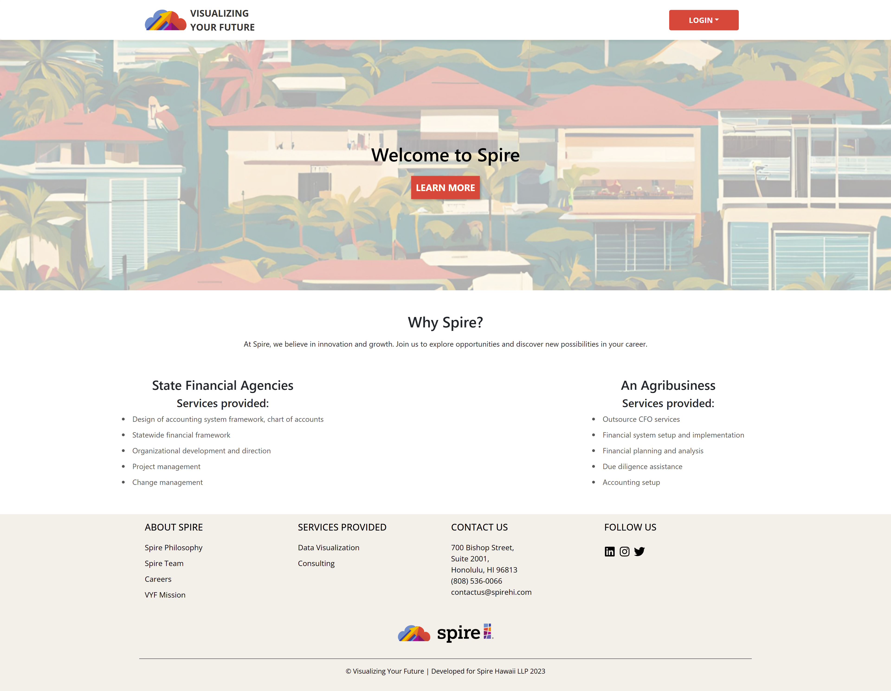

### Sign In Page
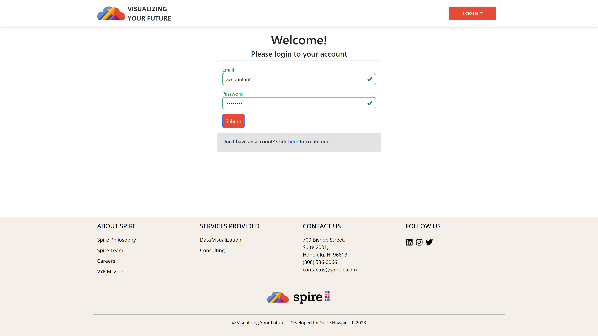

### MFA
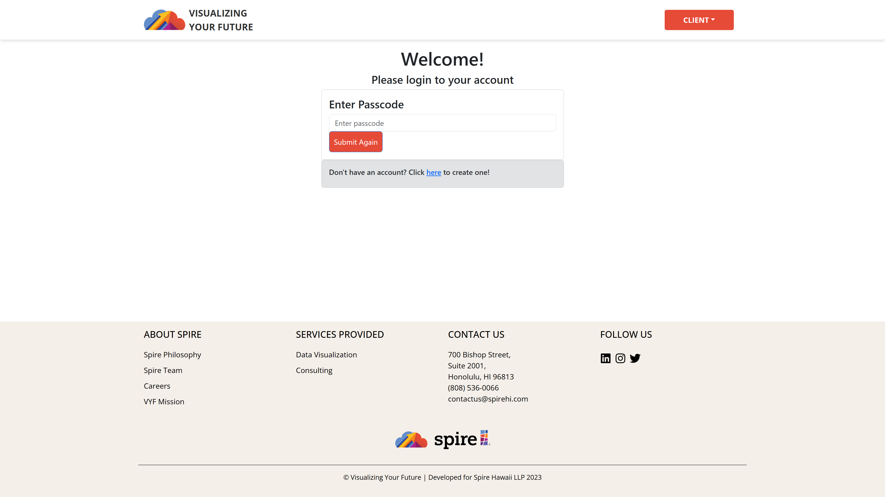

### Register Page
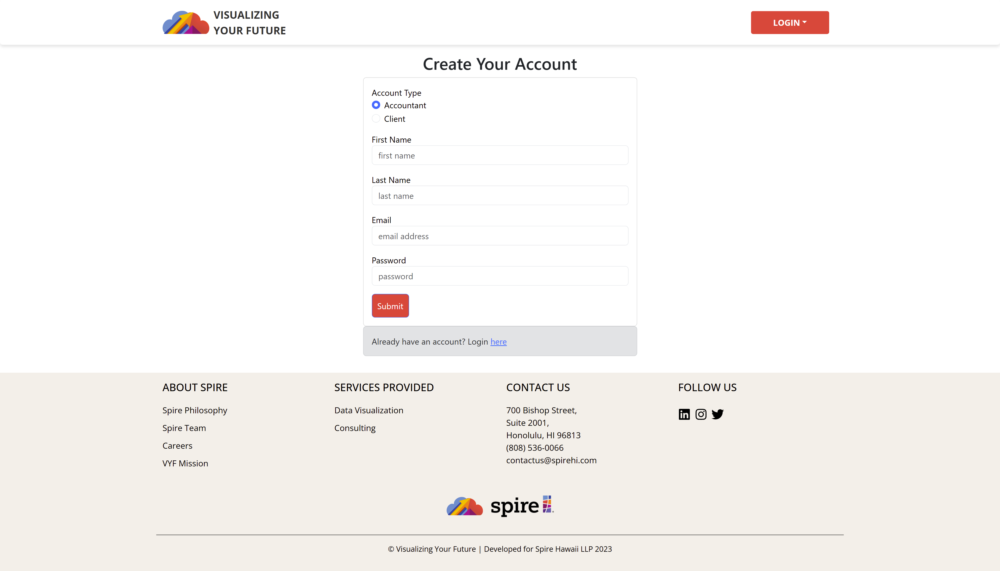

### Data Input Page
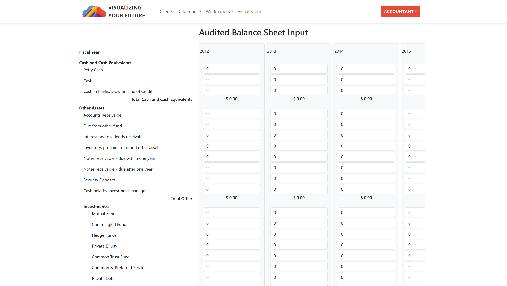

### Budget P&L Input Page
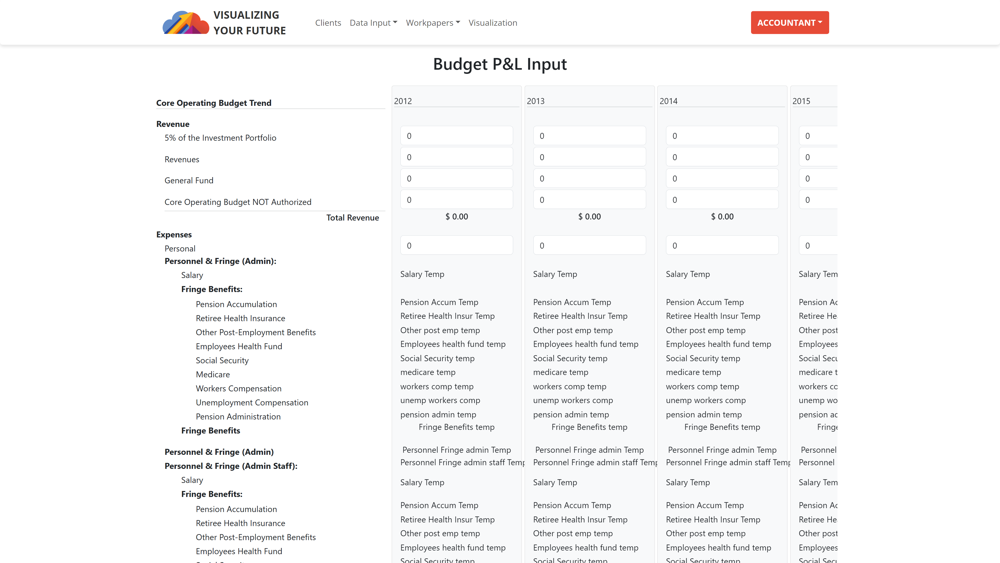

### Visualization Page
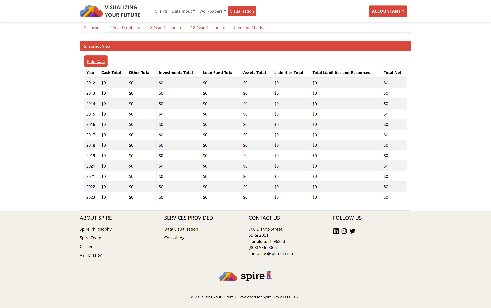
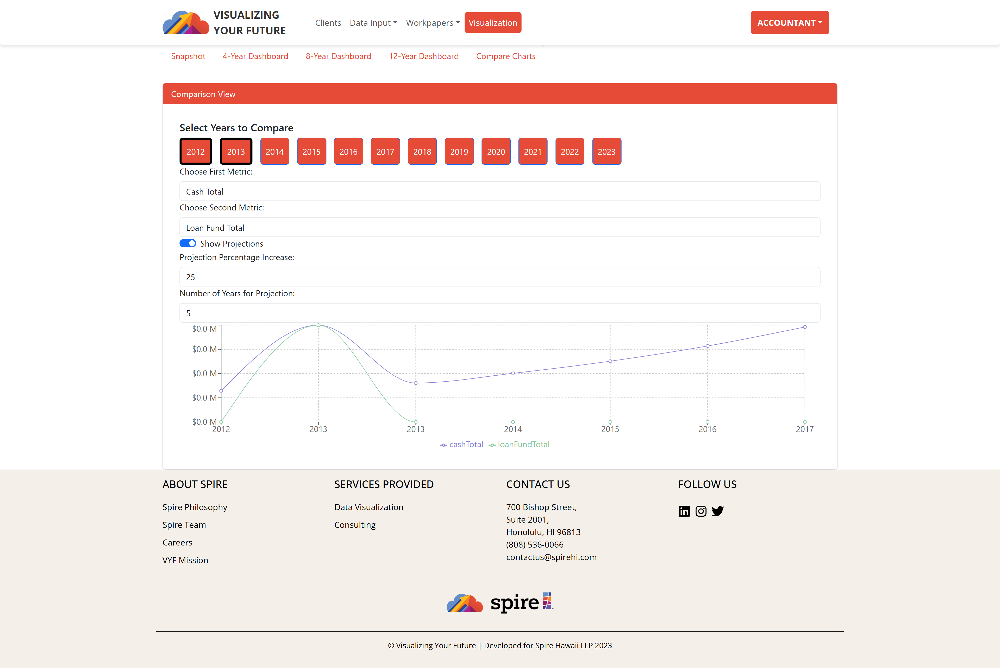

### Example of Workpapers
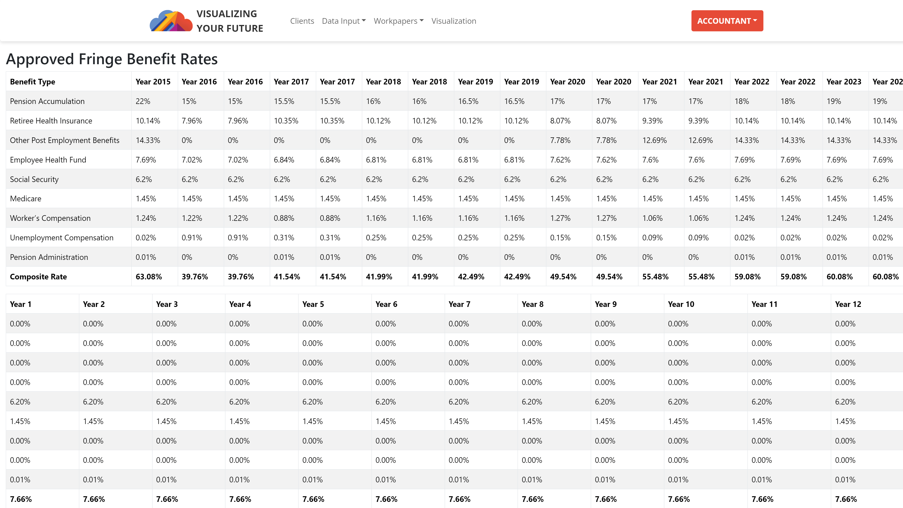

### Client Page
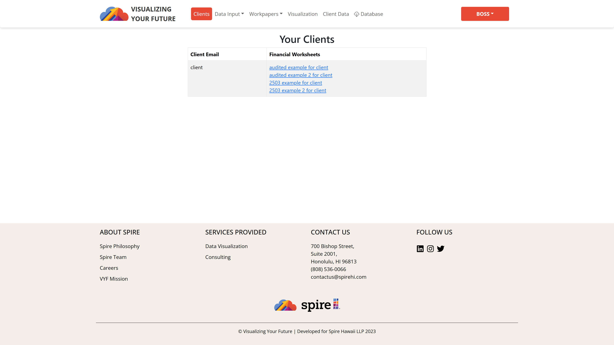

### Admin Landing Page
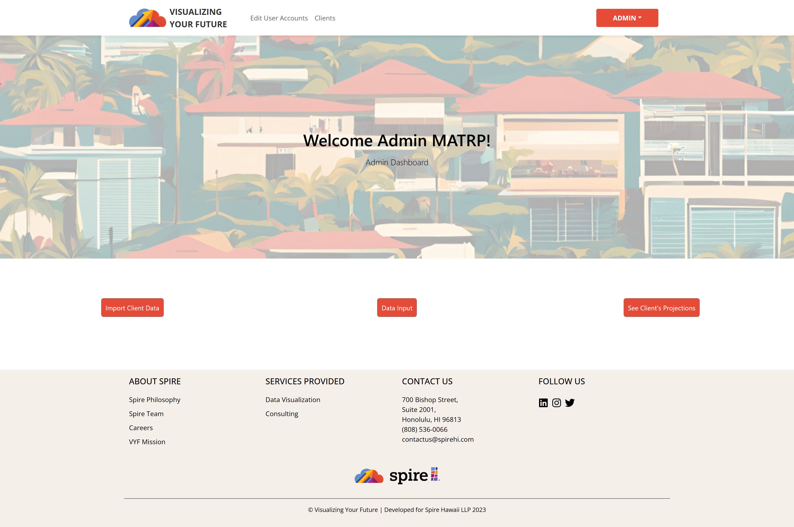

### All Profiles Page
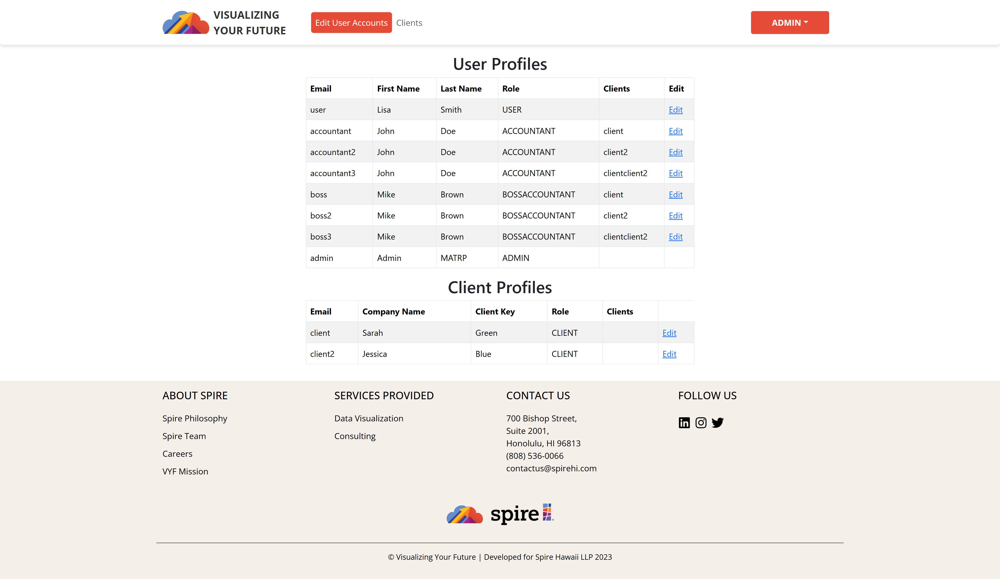

### Account Settings Page
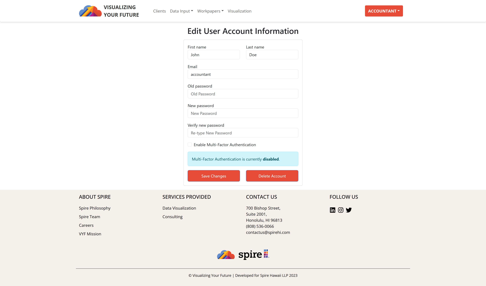


## Developer Guide
- First, [install Meteor](https://www.meteor.com/install), and [GitHub Desktop](https://desktop.github.com/).
- Second, go to [the Visualizing Your Future repo](https://github.com/visualizing-your-future/visualizing-your-future), click the "Code" dropdown and clone the digits repo (i.e. using the "Open with GitHub Desktop" option).
- Third, cd into the app/ directory of your local copy of the **Visualizing Your Future** app project, and install third party libraries via cmd or PowerShell:

```
$ meteor npm install
```
- Fourth, once the libraries are installed, you can run the application by invoking the following:

```
$ meteor npm run start
```
- Lastly, navigate to http://localhost:3000 to see the application running.

## Development Timeline
- Formed a team and created a Team Contract (8/26)
  - [Team Contract (via Google Docs)](https://docs.google.com/document/d/1doBCHLmaNrq029uUPOsjgCroXzaHk2N4mB1xNZ2wVPc/edit?pli=1)
- Created a GitHub organization and home page (8/28)
  - [Visualizing Your Future Github Organization](https://github.com/visualizing-your-future)
  - [Visualizing Your Future Home Page](https://visualizing-your-future.github.io/)
- Began Issue Driven Project Management with Milestone 1 (8/29-9/11)
  - [M1 Project Board](https://github.com/orgs/visualizing-your-future/projects/3)
- Entered Milestone 2 phase (9/12-10/2)
  - [M2 Project Board](https://github.com/orgs/visualizing-your-future/projects/10)
- Entered Milestone 3 phase (10/3-10/16)
  - [M3 Project Board](https://github.com/orgs/visualizing-your-future/projects/12)
- Entered Milestone 4 phase (10/17-10/23)
  - [M4 Project Board](https://github.com/orgs/visualizing-your-future/projects/17)
- Entered Milestone 5 phase (10/24-12/11)
  - [M5 Project Board](https://github.com/orgs/visualizing-your-future/projects/24)

## The Visualizing Your Future Team

### About Us
* [Github Organization](https://github.com/visualizing-your-future)
* [Team Contract](https://docs.google.com/document/d/1doBCHLmaNrq029uUPOsjgCroXzaHk2N4mB1xNZ2wVPc/edit?pli=1)

### Team Members
<div class="row" style="display: flex;">
    <div class="col" style="flex: 1;">
        <ul>
              <li><a href="mailto:gchang7@hawaii.edu">Galen Chang</a></li>
              <li><a href="mailto:jmjoson@hawaii.edu">Janel Michaela Joson</a></li>
              <li><a href="mailto:brianall@hawaii.edu">Briana Lee</a></li>
              <li><a href="mailto:thanghn@hawaii.edu">Hoang Nguyen</a></li>
              <li><a href="mailto:davidar@hawaii.edu">David Rickards</a></li>
              <li><a href="mailto:jserraon@hawaii.edu">John Serraon</a></li>
              <li><a href="mailto:vavalver@hawaii.edu">Victoria Valverde</a></li>
              <li><a href="mailto:spence2@hawaii.edu">Spencer Wells</a></li>
        </ul>
    </div>
</div>

## Misc. Links
* [Team Contract (via Google Docs)](https://docs.google.com/document/d/1doBCHLmaNrq029uUPOsjgCroXzaHk2N4mB1xNZ2wVPc/edit?pli=1)
* [Visualizing Your Future Github Organization](https://github.com/visualizing-your-future)
* [Visualizing Your Future Home Page](https://visualizing-your-future.github.io/)
* [M1 Project Board](https://github.com/orgs/visualizing-your-future/projects/3)
* [M2 Project Board](https://github.com/orgs/visualizing-your-future/projects/10)
* [M3 Project Board](https://github.com/orgs/visualizing-your-future/projects/12)
* [M4 Project Board](https://github.com/orgs/visualizing-your-future/projects/17)
* [M5 Project Board](https://github.com/orgs/visualizing-your-future/projects/24)
